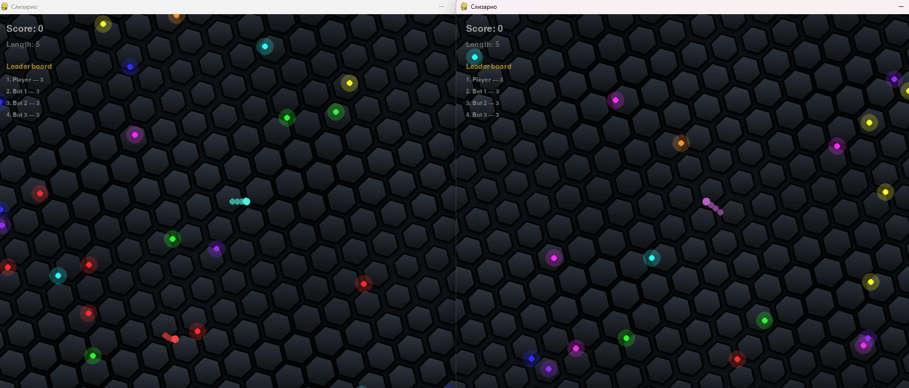

# Слизарио

Мультиплеерный клон [Slither.io](https://slither.io/) на **SpritePro**: змейка за курсором, еда, боты, камера follow, синхронизация змей и еды по TCP.



## Об авторе

Демо-игра **andrulok** — учебный/пет-проект в составе демо SpritePro (папка `slisario_andrulok`).

Автор реализовал полноценный геймплей «змейки в стиле Slither.io» без Unity: движение головы за курсором, цепочка сегментов, сбор еды и рост, столкновения со стенами и чужими телами, боты с простым ИИ, HUD со счётом и таблицей лидеров, тайловый фон и границы мира. Для мультиплеера используется встроенный networking SpritePro (`multiplayer=True`, `MultiplayerContext`, `send_every` / `poll`): хост синхронизирует еду, клиенты обмениваются позициями змей по TCP.

Это пример того, как на фреймворке можно собрать сетевую аркаду из сцен, спрайтов и сетевого API — без отдельного игрового движка.

## Запуск

```bash
pip install spritepro

# Одиночная игра (из корня репозитория)
python spritePro/demoGames/slisario_andrulok/main.py --single

# Локально: сервер + два окна
python spritePro/demoGames/slisario_andrulok/main.py --quick

# Хост (сервер + первое окно)
python spritePro/demoGames/slisario_andrulok/main.py --host_mode --host 127.0.0.1 --port 5050

# Клиент (нужен уже запущенный сервер)
python spritePro/demoGames/slisario_andrulok/main.py --host 127.0.0.1 --port 5050
```

Управление: **курсор** — направление; после смерти — **R**.

## Структура

- `game/` — змейка, еда, мир, боты
- `scenes/game_scene.py` — игровая сцена и сетевая синхронизация
- `ui/hud.py` — счёт и таблица лидеров
- `images/bg.jpg` — тайловый фон
